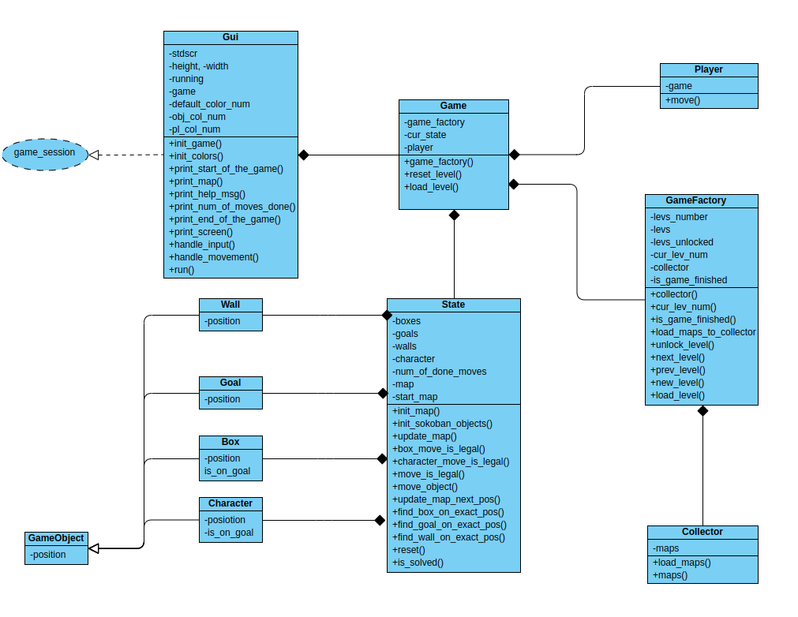

# Sokoban
Basic version of the Sokoban game implemented as a terminal game with an option to add new levels.

### Installation
To install the game, follow these steps:

1. Create a virtual environment:
```bash
mkdir your_directory
cd your_directory
python3 -m venv .venv
```

Activate the virtual environment:
```bash
source .venv/bin/activate
```
3. Clone the repository
```bash
git clone https://github.com/janagor/sokoban.git
```
### Starting the game
To start the game, use the following commands:
```bash
cd sokoban
python3 sokoban.py
```

### Levels
To create your own level:
1. Create a *level_number.txt* file where *level_number* is the number of your level
2. Use the following format for representing Sokoban level:

|Level element|Character|
|:------------ |:---------------:|
|Wall|#|
|Player|@|
|Player on goal|+|
|Box|$|
|Box on goal|*|
|Goal|.|
|Floor|(space)|

For example, a level file may may look like this:

```bash
  ###
  #.#
  # ####
###$ $.#
#. $@###
####$#
   #.#
   ###
```

### Level format
The level should be surrounded by walls. The first level's number must equal 1. Following levels should have numbers incremented by one. The level file must not have any other characters than those listed above. The default color of a level and a player is white. However, you can change their colors while starting the game. To do so, you need to add additional parameters:
1. `--game_color` or `-g`, with the preferred color to change game's color, for example:
```bash
python3 sokoban.py --game_color 'green'
```
2. `--player` or `-p`, with preferred color to change player's color, for example:
```bash
python3 sokoban.py --player_color 'red'
```

Available colors:
* `blue`
* `cyan`
* `green`
* `magenta`
* `red`
* `white`
* `yellow`


`White` is the default color for both map and player.

### UML Diagram visualizing chosen architecture



